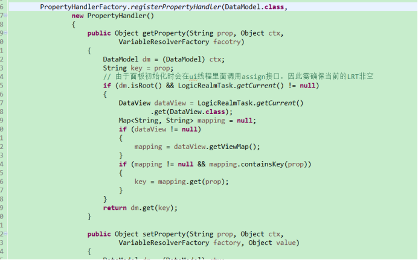
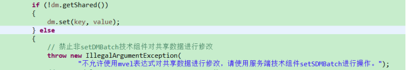
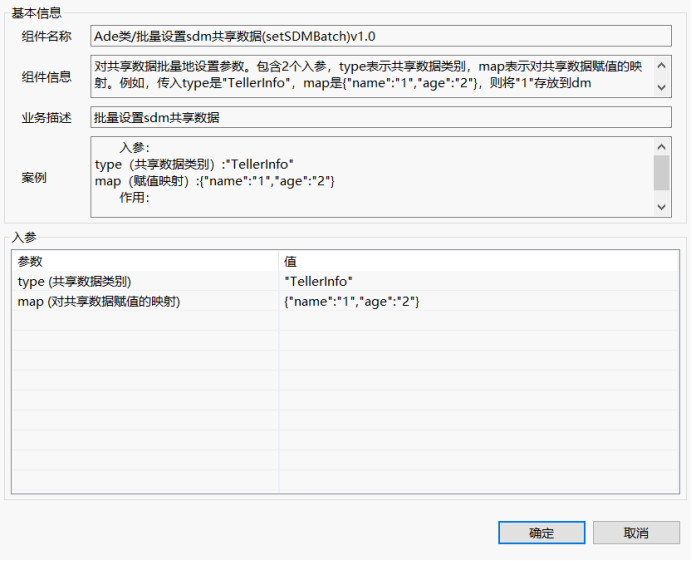

### 1：问题描述 
现平台对共享数据的修改的途径有很多，可以在服务端也可以在客户端进行修改，而且不能批量修改，只能一个个赋值，导致会出现不同步的情况，或者修改丢失的问题。
### 2：问题分析 
除了SetParameter、SetParameters这些技术组件外，只要是能写mvel语句在出参上的所有技术组件，都能对共享数据进行修改，不管是服务端还是客户端组件，这样对共享数据的处理和优化带来混淆和阻碍。因此需要对其整合，新建一个专门对SDM进行赋值的技术组件，把其他能对SDM进行修改的地方给屏蔽掉，并弹出错误。
经查看，发现一切组件对共享数据的修改都要经过DefaultExpressionEngine这个类的assign（）方法，这方法最终都会跑到MVEL. _setProperty_ ( __this__ , expression, value)；这里，然后会跑到上面我们注册好的PropertyHandler的setProperty()方法里：

在这里我们就可以对共享数据的修改操作进行过滤，并抛出异常让开发人员知道：

### 3、 问题解决
通过在DefaultExpressionEngine类里对共享数据的修改进行过滤掉后，平台再也没有途径对共享数据的内容进行修改了，这时候我们新增一个服务端的技术组件setSDMBatch，批量修改共享数据。技术组件有两个入参，一个是type(共享数据类别)，就是你想对哪个共享数据进行批量操作，另一个是map(对共享数据赋值的映射)。

这样再也不需要通过在出参那里写mvel语法如dm(‘TellerInfo’).xxx进行对共享数据的修改，并且可批量赋值，防止共享数据修改不同步。
### 4、 习题
平台通过mvel语法对共享数据的修改最终都会跑到哪个类上？
