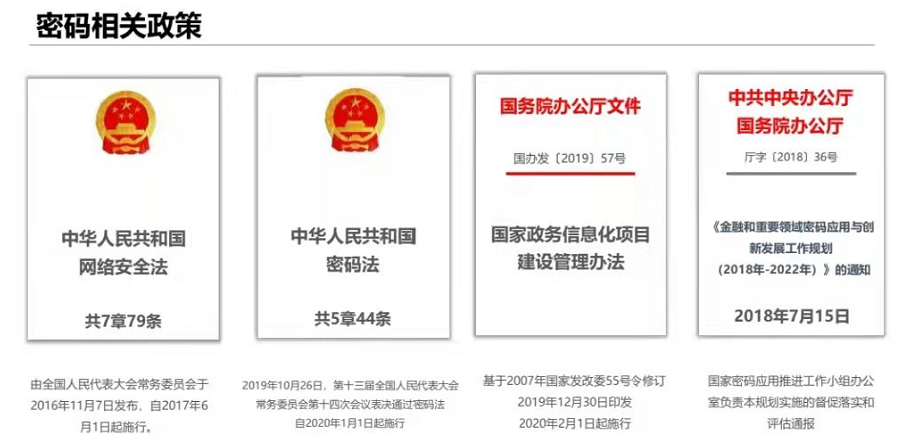
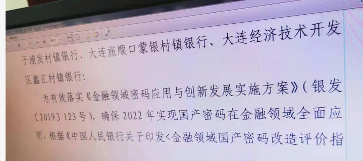
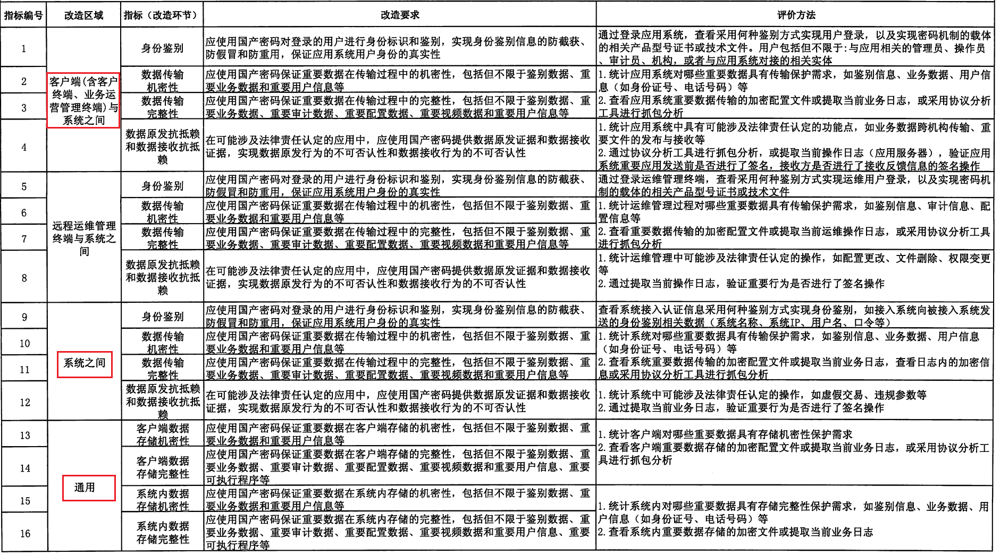

### 政策截图

### 银行国密改造，主要有以下政策要求
|颁发机构 |政策要求 |
|:--|
|中办、国办联合印发 |金融和重要领域密码应用与创新发展工作规划(2018-2022年)（中办 [2018] 36号文） |
|人民银行 |金融领域密码应用与创新发展实施方案（银发 [2019] 123号文） |
|人民银行 |金融领域国产化密码改造评价指标与基线（银发 [2020] 140号文） |
### 时间线如下
2018年国家密码管理局发布了密码行业标准GM/T0054-2018《信息系统密码应用 基本要求》。同年，中共中央办公厅印发36号文《金融和重要领域密码应用与创新发展工作规划(2018-2022年)》（以下简称36号文），对金融及关键基础设施行业的国密改造工作进行了明确要求。2020年人行在36号文的基础上颁发140号文 《金融领域国产化密码改造评价指标与基线》，进一步细化了金融行业国密算法改造的相关要求。
### 友商简单解读
国产密码改造基线140号文，主要扩大了需要保护的数据范围，细化了数据传输完整性、大报文加密、客户端与服务端之间机密性、数据存储完整性的要求，并提出了评价指标等一系列内容。
### 金融领域国产化密码改造评价基线

### 金融领域国产化密码改造评价指标

### 总结
结合与其他项目沟通，总结出以下要求
1. 数据传输机密性：对通道、全报文或者关键字段进行加密（指标解读而来）
2. 数据传输完整性：对传输报文进行完整性校验（指标解读而来）
3. 使用的加密模块具备商用密码检测中心颁发的认证证书，采用自研软算法模块，应申请并提供相应认证证书信息，如果暂未获得认证证书，可提供相关申请材料（黄弢邮件而来）
4. 部分银行在2022年6月底需要完成改造，之后人行进行检查（与大连、郑州银行等沟通而来）