### 1、背景

21 年 9 月，资管部统一从市场收集需要商用密码认证的需求
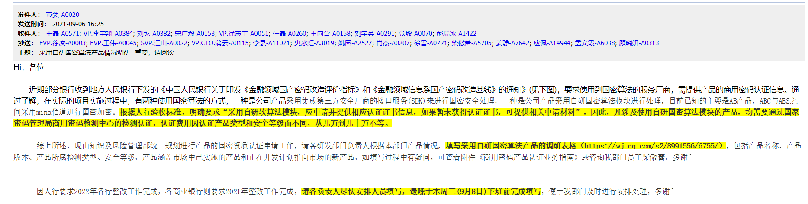
市场侧反馈 AB345 均需要具备认证证书
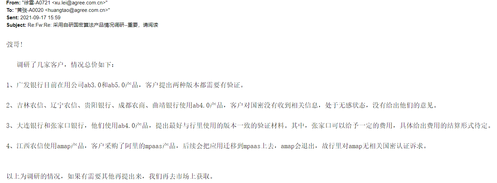

### 2、准备材料

认证时，需要准备如下材料，检测中心提供相关模版，其中以下三份材料难以编写
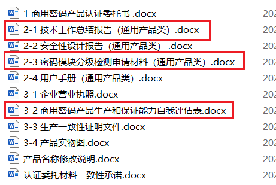
2-1 体现总体技术设计方案，包含设计原理，工作原理，工作流程等
2-3 需要结合 GM/T 0039-2015《密码模块安全检测要求》和 GM/T 0028-2014《密码模块安全技术要求》来编写
3-2 对检测中心提出的检测点，进行评估

##### 检测要求

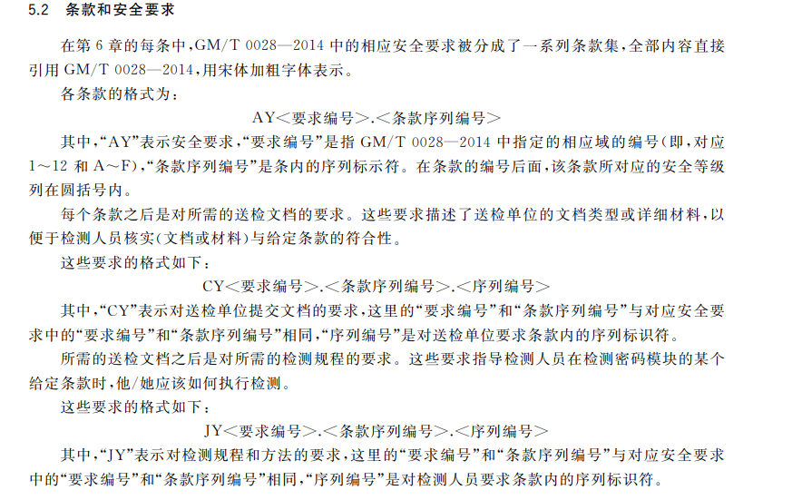
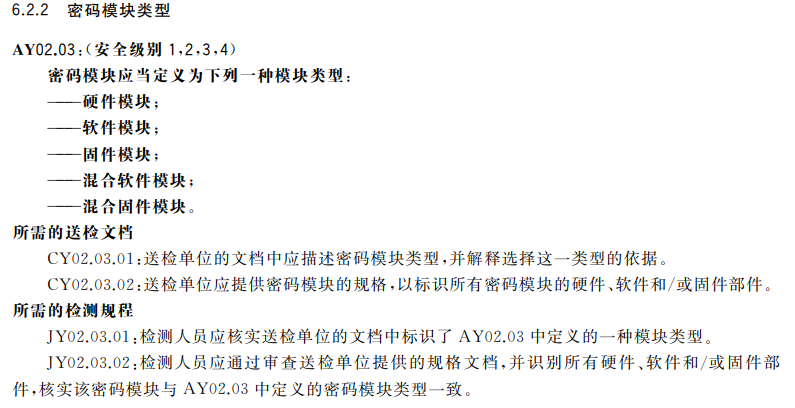

##### 申请材料

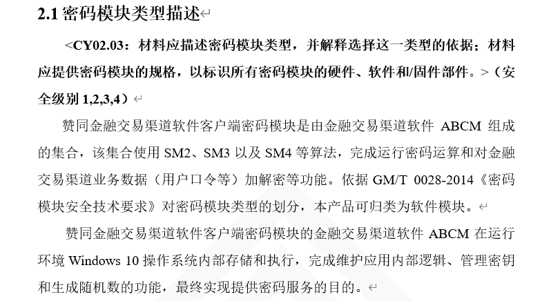

### 3、寻找中介

看到上面需要编写的内容后，提出以咱们的现有人员，无法完成编写，查看 csdn 上文章作者，提供检测代理服务，资管部联系后，确定使用中介帮助
https://blog.csdn.net/Lapedius/article/details/108331439
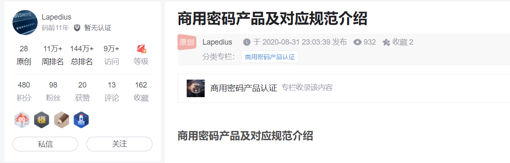
21 年 11 月公司与中介签订合同，确定认证<赞同金融交易渠道软件密码模块 ABCM>，准备检测材料与演示版本
期间对材料进行补充与整改
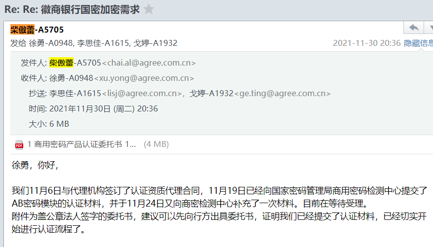

### 4、客户端模块

21 年 12 月上旬，检测中心反馈送检的系统中存在客户端与服务端，需要分开送检，并建议改名为<赞同金融交易渠道软件客户端密码模块 ABCM>，资管部收集各市场信息，并决定先检测客户端，明年如果有需要，再增加服务端检测
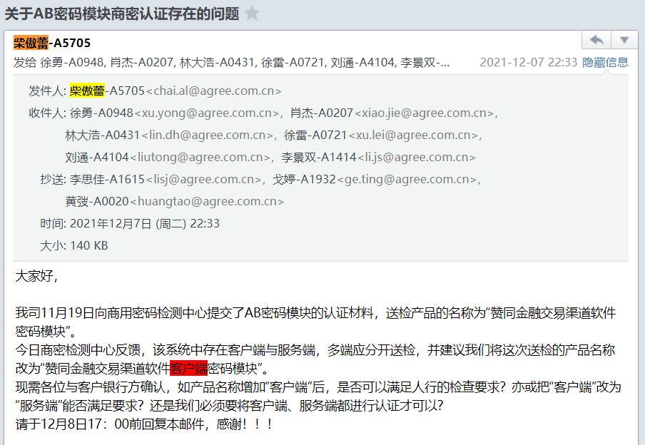

### 5、收到受理通知

21 年 12 月下旬，检测中心发来受理通知，正式开始检测
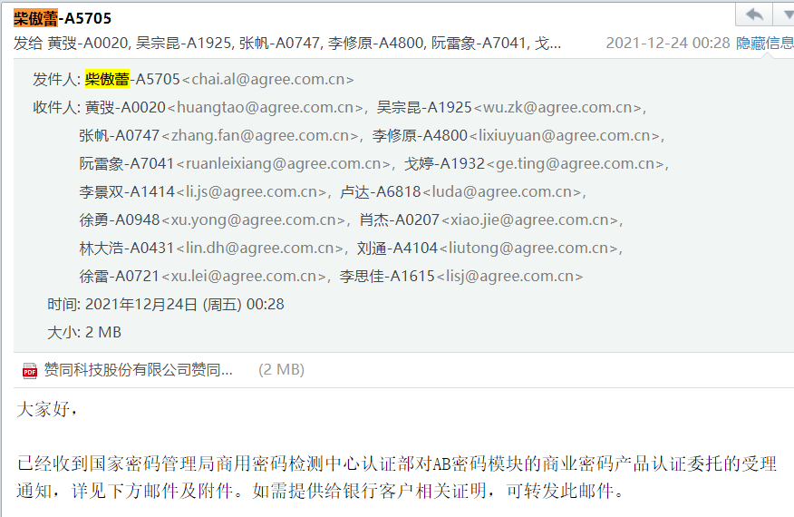

### 6、检测中心约会议，初步沟通

22 年 3 月，与检测中心初步线上沟通，简单介绍检测过程，与中间需要配合的内容，对产品进行演示，检测中心提出需要整改的内容
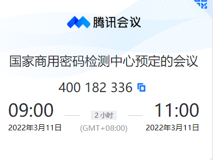
中介后面给出预计检测计划
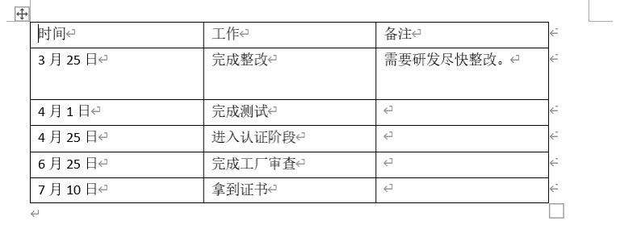

### 7、整改完成，邮寄机器

22 年 3 月底，程序与文档全部整改完成，4 月初准备好设备，并寄到检测中心，包含物理机一台+密码卡，刘老师笔记本，4G 无线路由器一个
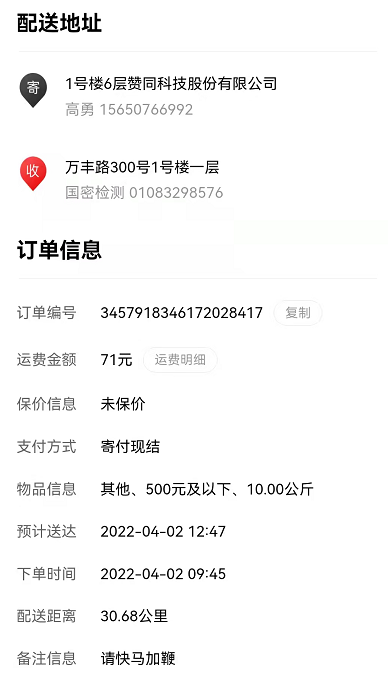

### 8、给商密中心远程演示

22 年 4 月 11 日，在检测中心远程给检测人员吕竹青演示，并提交测试数据

### 9、sslvpn 对接测试

22 年 4 月 13 日，提交 sslvpn 测试数据
