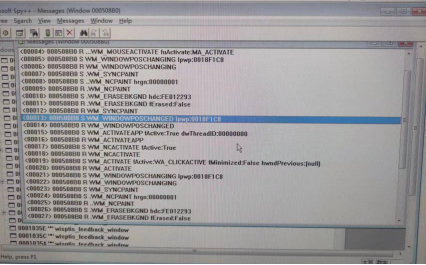
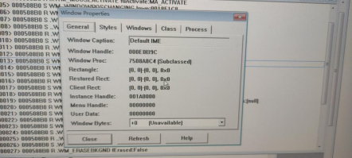
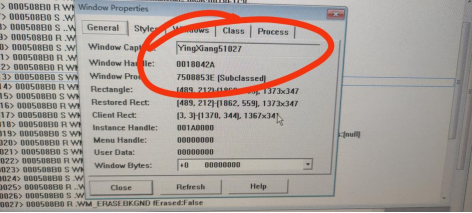

### 王文虎 创建于 2021-12-28
# 问题描述
在调用信雅达影像控件的提交接口的时，会导致客户端窗口置后。
# 问题分析
①客户端中未发现有置后客户端的代码逻辑
②通过之前情况的经验，推测和影像控件有关。
③搭建复现环境，通过SPY++工具找出窗口消息，验证推测。
# 问题解决
## SPY++工具
可利用 Spy++ 执行以下任务：
-  搜索指定窗口、线程、进程或消息。
-  查看所选窗口、线程、进程或消息的属性。
-  直接从视图中选择窗口、线程、进程或消息。
-  使用查找程序工具，通过鼠标指针定位选择窗口。
-  显示系统对象之间关系的图形数，这些对象包括进程、线程、和窗口。
## 窗口样式
### GWL_STYLE(样式)
||~样式||~说明||
||WS_BORDER||窗口有一个细线边框。||   
||WS_CAPTION||窗口有一个标题栏（包括 WS_BORDER 样式）||
||WS_CHILD||该窗口是一个子窗口。具有这种风格的窗口不能有菜单栏。此样式不能与WS_POPUP 样式一起使用 。||
||WS_CHILDWINDOW||与WS_CHILD 样式相同 。||
||WS_CLIPCHILDREN||当绘制发生在父窗口内时，排除子窗口占用的区域。创建父窗口时使用此样式。||
||WS_CLIPSIBLINGS||相对于彼此剪辑子窗口；也就是说，当特定的子窗口收到 WM_PAINT 消息时，  WS_CLIPSIBLINGS 样式将所有其他重叠的子窗口剪裁出要更新的子窗口区域。如果  未指定WS_CLIPSIBLINGS并且子窗口重叠，则在子窗口的客户区域内绘制时，可能会在相邻子窗口的客户区域内绘制。||
||WS_DISABLED||该窗口最初是禁用的。禁用的窗口无法接收来自用户的输入。要在创建窗口后更改此设置，请使用 EnableWindow 函数。||
||WS_DLGFRAME||该窗口具有通常用于对话框的样式的边框。具有这种风格的窗口不能有标题栏。||
||WS_GROUP||窗口是一组控件中的第一个控件。该组由第一个控件和在它之后定义的所有控件组成，直到下一个具有WS_GROUP 样式的控件 。每个组中的第一个控件通常具有 WS_TABSTOP 样式，以便用户可以在组之间移动。用户随后可以使用方向键将键盘焦点从组中的一个控件更改为组中的下一个控件。||
||WS_HSCROLL||该窗口有一个水平滚动条。||
||WS_ICONIC||该窗口最初是最小化的。与WS_MINIMIZE 样式相同 。||
||WS_MAXIMIZE||窗口最初是最大化的。||
||WS_MAXIMIZEBOX||该窗口有一个最大化按钮。不能与WS_EX_CONTEXTHELP样式结合使用 。该 WS_SYSMENU 风格也必须指定。 ||
||WS_MINIMIZE||该窗口最初是最小化的。与WS_ICONIC 样式相同 。||
||WS_MINIMIZEBOX||该窗口有一个最小化按钮。不能与WS_EX_CONTEXTHELP样式结合使用 。该 WS_SYSMENU 风格也必须指定。 ||
||WS_OVERLAPPED||该窗口是一个重叠窗口。重叠窗口具有标题栏和边框。与WS_TILED 样式相同 。||
||WS_OVERLAPPEDWINDOW(WS_OVERLAPPED | WS_CAPTION | WS_SYSMENU | WS_THICKFRAME | WS_MINIMIZEBOX | WS_MAXIMIZEBOX)||该窗口是一个重叠窗口。与WS_TILEDWINDOW 样式相同 。 ||
||WS_POPUP||窗口是一个弹出窗口。此样式不能与WS_CHILD 样式一起使用 。||
||WS_POPUPWINDOW(WS_POPUP | WS_BORDER | WS_SYSMENU)||该窗口是一个弹出窗口。该 WS_CAPTION 和 WS_POPUPWINDOW 风格一定要结合使窗口菜单可见。||
||WS_SIZEBOX||窗口有一个大小边框。与WS_THICKFRAME 样式相同 。||
||WS_SYSMENU||该窗口的标题栏上有一个窗口菜单。该 WS_CAPTION 风格也必须指定。||
||WS_TABSTOP||窗口是一个控件，当用户按下TAB键时可以接收键盘焦点。按 TAB 键会将键盘焦点更改为下一个具有WS_TABSTOP 样式的控件 。||
||WS_THICKFRAME||窗口有一个大小边框。与WS_SIZEBOX 样式相同 。||
||WS_TILED||该窗口是一个重叠窗口。重叠窗口具有标题栏和边框。与WS_OVERLAPPED 样式相同 。 ||
||WS_TILEDWINDOW(WS_OVERLAPPED | WS_CAPTION | WS_SYSMENU | WS_THICKFRAME | WS_MINIMIZEBOX | WS_MAXIMIZEBOX)||该窗口是一个重叠窗口。与WS_OVERLAPPEDWINDOW 样式相同 ||
||WS_VISIBLE||该窗口最初是可见的。||
||WS_VSCROLL||该窗口有一个垂直滚动条。||
### GWL_EXSTYLE (扩展样式)
||~扩展样式||~说明||
||WS_EX_CONTROLPARENT||窗口本身包含应该参与对话框导航的子窗口。如果指定了此样式，则在执行导航操作（例如处理 TAB 键、箭头键或键盘助记符）时，对话框管理器会递归到此窗口的子窗口中。||
||WS_EX_DLGMODALFRAME||窗口有双边框；该窗口可以任选地用一个标题栏，通过指定所创建的 WS_CAPTION 在样式 dwStyle 参数。||
||WS_EX_LAYERED||该窗口是一个 分层窗口。如果窗口中有一个不能用这种风格 类样式 之一 CS_OWNDC 或 CS_CLASSDC。Windows 8的： 该 WS_EX_LAYERED 样式支持顶级窗口和子窗口。以前的 Windows 版本 仅对顶级窗口支持WS_EX_LAYERED。||
||WS_EX_LAYOUTRTL||如果 shell 语言是希伯来语、阿拉伯语或其他支持阅读顺序对齐的语言，则窗口的水平原点在右边缘。增加水平值向左前进。 ||
||WS_EX_LEFT||该窗口具有通用的左对齐属性。这是默认设置。||
||WS_EX_LEFTSCROLLBAR||如果外壳语言是希伯来语、阿拉伯语或其他支持阅读顺序对齐的语言，则垂直滚动条（如果存在）位于客户区的左侧。对于其他语言，样式将被忽略。||
||WS_EX_LTRREADING||窗口文本使用从左到右的阅读顺序属性显示。这是默认设置。||
||WS_EX_MDICHILD||该窗口是一个 MDI 子窗口。||
||WS_EX_NOACTIVATE||使用这种样式创建的顶级窗口在用户单击时不会成为前台窗口。当用户最小化或关闭前台窗口时，系统不会将该窗口置于前台。不应通过编程访问或通过可访问技术（例如讲述人）的键盘导航来激活该窗口。要激活窗口，请使用 SetActiveWindow 或 SetForegroundWindow函数。默认情况下，该窗口不会出现在任务栏上。要强制窗口出现在任务栏上，请使用 WS_EX_APPWINDOW 样式。||
||WS_EX_NOINHERITLAYOUT||该窗口不会将其窗口布局传递给其子窗口。||
||WS_EX_NOPARENTNOTIFY||使用此样式创建的子窗口在创建或销毁时不会向其父窗口发送 WM_PARENTNOTIFY消息。||
||WS_EX_NORDIRECTIONBITMAP||窗口不会呈现到重定向表面。这适用于没有可见内容或使用表面以外的机制来提供其视觉效果的窗口。||
||WS_EX_OVERLAPPEDWINDOW(WS_EX_WINDOWEDGE | WS_EX_CLIENTEDGE)||该窗口是一个重叠窗口。||
||WS_EX_PALETTEWINDOW(WS_EX_WINDOWEDGE | WS_EX_TOOLWINDOW | WS_EX_TOPMOST)||该窗口是调色板窗口，它是一个显示一系列命令的无模式对话框。|| 
||WS_EX_RIGHT||该窗口具有通用的“右对齐”属性。这取决于窗口类。此样式仅在 shell 语言为希伯来语、阿拉伯语或其他支持阅读顺序对齐的语言时有效；否则，样式将被忽略。使用 WS_EX_RIGHT 风格静态或编辑控件具有与使用相同的效果 SS_RIGHT 或 ES_RIGHT 风格，分别。将此样式与按钮控件一起使用与使用BS_RIGHT 和 BS_RIGHTBUTTON 样式具有相同的效果 。 ||
||WS_EX_RIGHTSCROLLBAR||垂直滚动条（如果存在）位于客户区的右侧。这是默认设置。||
||WS_EX_RTLREADING||如果外壳语言是希伯来语、阿拉伯语或其他支持阅读顺序对齐的语言，则使用从右到左阅读顺序属性显示窗口文本。对于其他语言，样式将被忽略。||
||WS_EX_STATICEDGE||该窗口具有 3 维边框样式，旨在用于不接受用户输入的项目。||
||WS_EX_TOOLWINDOW||该窗口旨在用作浮动工具栏。工具窗口有一个比普通标题栏短的标题栏，窗口标题使用较小的字体绘制。工具窗口不会出现在任务栏或用户按 ALT+TAB 时出现的对话框中。如果工具窗口具有系统菜单，则其图标不会显示在标题栏上。但是，您可以通过右键单击或键入 ALT+SPACE 来显示系统菜单。 ||
||WS_EX_TOPMOST||该窗口应放置在所有非最顶层窗口的上方，并应保持在它们上方，即使该窗口已停用。要添加或删除此样式，请使用 SetWindowPos 函数。||
||WS_EX_TRANSPARENT||在绘制窗口下方的兄弟节点（由同一线程创建）之前，不应绘制该窗口。窗口看起来是透明的，因为底层同级窗口的位已经被绘制。要在没有这些限制的情况下实现透明度，请使用 SetWindowRgn 函数。||
||WS_EX_WINDOWEDGE||窗口有一个带有凸起边缘的边框。||
## SPY++消息窗口
||~代码||~意义||
||P||使用PostMessage函数将消息发送到队列。没有可用的关于消息的最终处置的信息
||S||使用SendMessage函数发送消息。这意味着，发送方在接收方处理和返回改消息之前不会重新获取控制。因此，接收方可以将一个返回值传送回发送方。||
||s||消息已发送，但安全性阻止对方对返回值的访问。||
||R||每个“S”行都具有一个对应的列出消息返回值的"R"(返回)行。有时消息调用被嵌套，这意味着一个消息处理程序发送了另一个。||
## 监听客户端窗口的消息
- `WM_ACTIVATE：一个窗口被激活或失去激活状态`
- `WM_WINDOWPOSCHANGING:本消息会发送给那些大小和位置将被改变的窗口`

说明：调用影像控件提交时，监听客户端的消息，查看每一条消息，找到了一条关于影像控件的消息。与厂商沟通后，验证了影像控件有置后的逻辑，为了提交接口的提示框能在最上方显示。
## 让影像控件脱离父子关系，独立存在。
解除com.sun.jna.platform.win32.User32.SetParent()绑定的父子窗口关系，生成影像控件窗口后调用提交接口，效果见附件的视频。
## 查阅官方文档
通过信雅达影像控件厂商了解到他们的生成的窗口是WS_POPUP样式的。
官方SetParent（）API文档：
An application can use the **SetParent** function to set the parent window of a pop-up, overlapped, or child window.
If the window identified by the *hWndChild* parameter is visible, the system performs the appropriate redrawing and repainting.
For compatibility reasons, **SetParent** does not modify the **WS_CHILD** or **WS_POPUP** window styles of the window whose parent is being changed. Therefore, if *hWndNewParent* is **NULL**, you should also clear the **WS_CHILD** bit and set the **WS_POPUP** style after calling **SetParent**. Conversely, if *hWndNewParent* is not **NULL** and the window was previously a child of the desktop, you should clear the **WS_POPUP** style and set the **WS_CHILD** style before calling **SetParent**.
When you change the parent of a window, you should synchronize the UISTATE of both windows.
翻译：
应用程序可以使用 **SetParent**函数设置弹出窗口、重叠窗口或子窗口的父窗口。
如果 *hWndChild* 参数标识的窗口是可见状态，系统将执行适当的重画和重新绘制。
出于兼容性原因，**SetParent**函数不会修改父窗口正在更改的窗口的**WS_CHILD**或**WS_POPUP** 样式。因此，如果*hWndNewParent* 为 **NULL**，则还应清除**WS_CHILD**样式，并在调用SetParent后设置 **WS_POPUP**样式。相反，如果 *hWndNewParent*不为 **NULL**，并且窗口以前是桌面的子窗口，则应在调用**SetParent**.之前清除**WS_POPUP**样式并设置 **WS_CHILD**样式。
更改窗口的父窗口时，应同步两个窗口的UISTATE。
# 总结
因为对WIndows窗口开发的不熟悉和对厂商控件控件的认识不足，所以才会造成的关联性错误。通过绑定父子关系前，清理掉控件的**WS_POPUP**样式，置后的问题解决。

