## 相关知识

[内存术语（译）](https://www.tapd.cn/65362886/markdown_wikis/show/#1165362886001002684)
[修复内存问题（译）](https://www.tapd.cn/65362886/markdown_wikis/show/#1165362886001002685)
[录制内存快照（译）](https://www.tapd.cn/65362886/markdown_wikis/show/#1165362886001002687)

## 出现内内存泄漏的情况

### console.log

看下面代码：

```js
let template = 'Lorem ipsum dolor, sit amet consectetur adipisicing elit. Sint animi cumque perspiciatis deserunt quam exercitationem unde tenetur debitis veritatis suscipit, dolorem veniam sequi rerum nisi, repudiandae qui ea dolor. Laboriosam?',
    count = 100;
for(let i=0; i<count; i++) {
    console.log(`${i+1}-${template}`);
}
```

结果如下图：

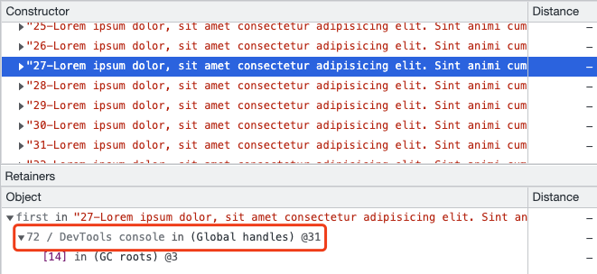

### 事件监听

这里有两种，一种我们直接使用`addEventListener`进行事件监听，另一种是vue提供的事件监听机制。

**原生的addEventListener**

通过分析下列内存截图：

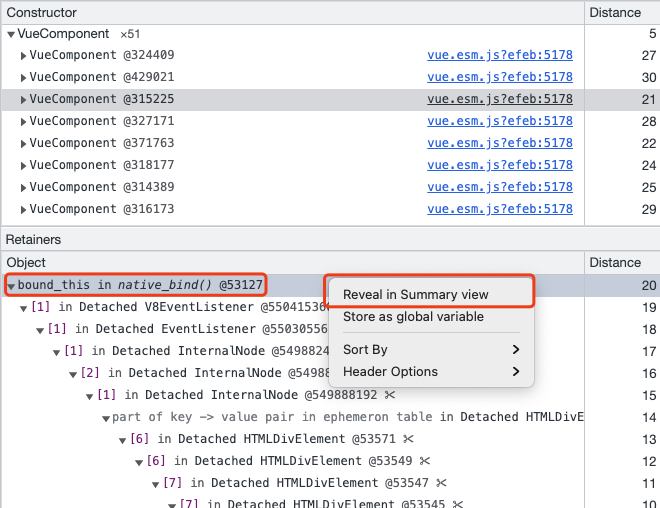

跳转到对应的视图：

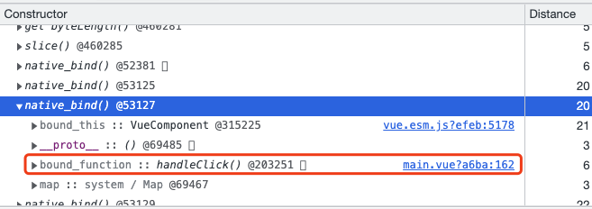

可以通过鼠标hover查看当前组件的信息：

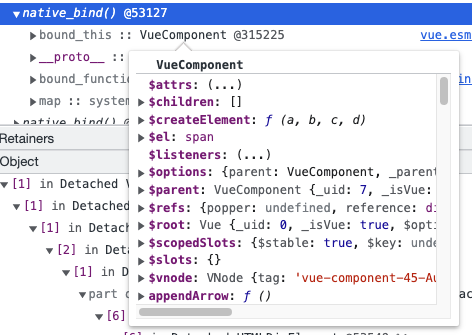

通过上述分析，找到对应文件，发现对应代码。原因是使用了`addEventListener`但未在组件销毁时进行移除操作。

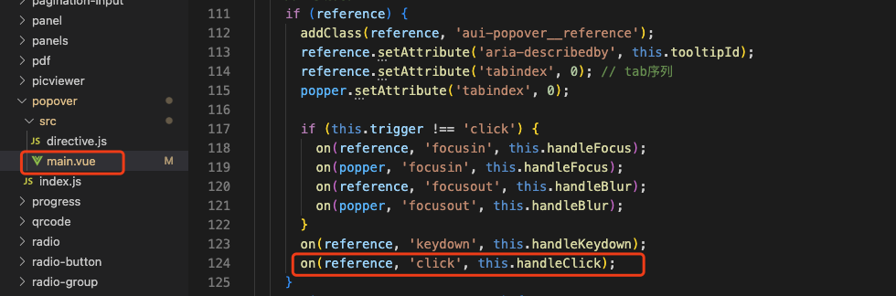

**vue @event**

在看下面一个内存截图：

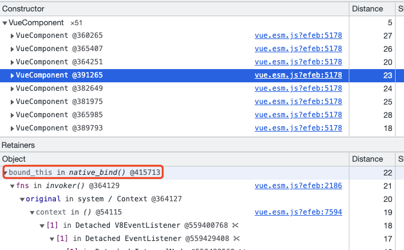

通过右键跳转到对应的位置：

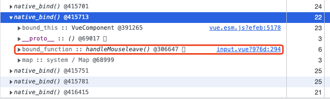

根据分析找到对应代码。

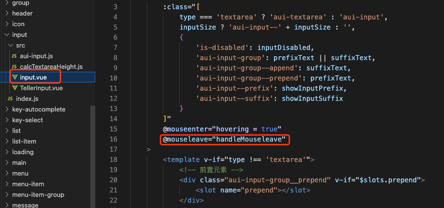

该问题为vue本身问题，由于使用`v2.6.14`版本并未修复，已有[PR](https://github.com/vuejs/vue/pull/10085)计划在`v2.6.15`版本修复，却迟迟没有发布，但在`v2.7`版本中已经修复了。

解决方案如下：

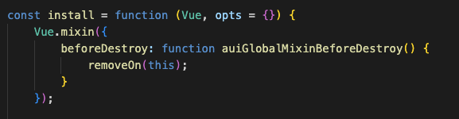

### MutationObserver

这是一种新的内存泄漏问题，如下图：

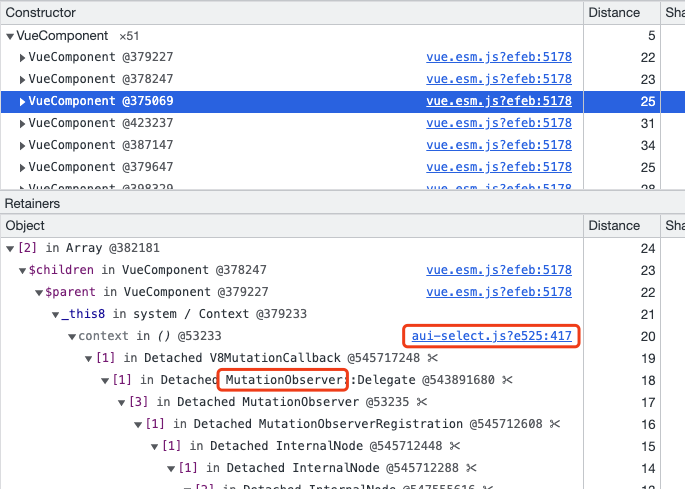

通过分析找到源码位置：

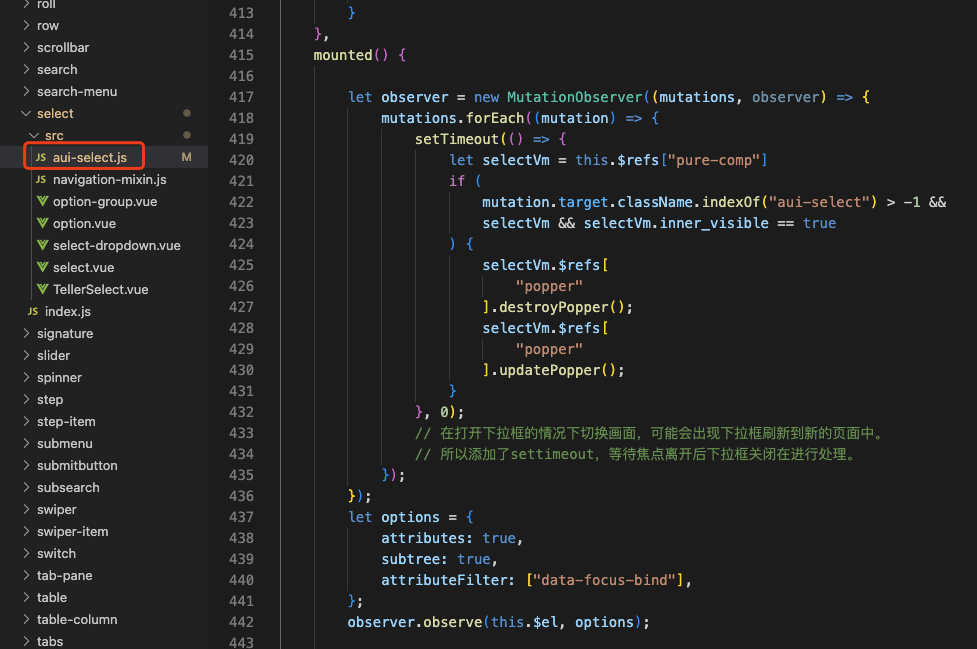

解决方案如下：

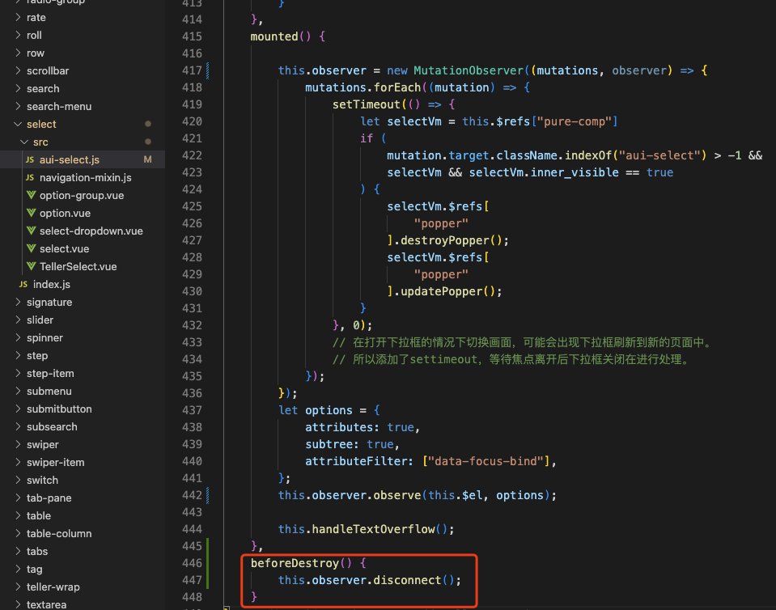

### msgbox inject

但是还没有完，解决了上面的问题内存快照变成这样了：

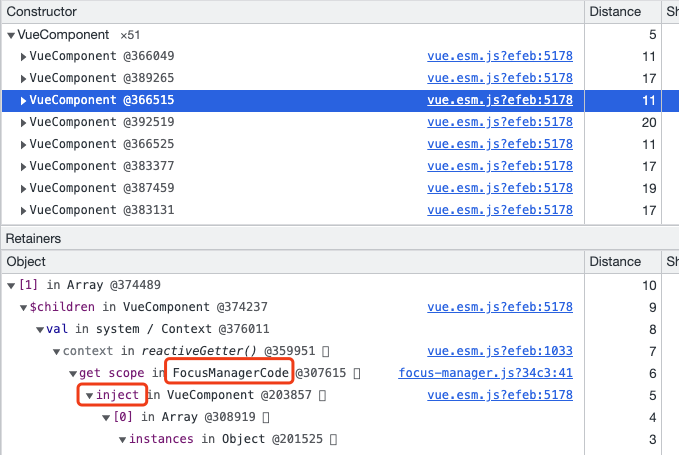

通过鼠标悬浮查看当前组件的信息：

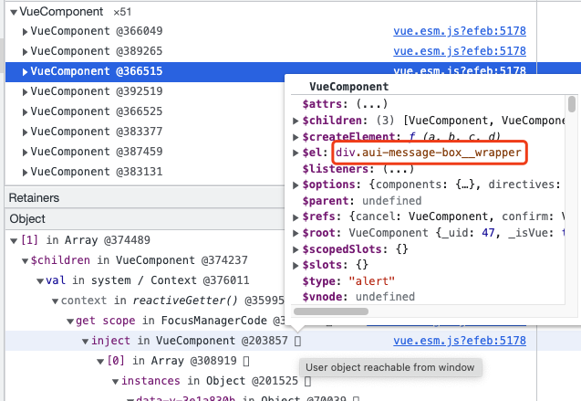

定位源码位置：

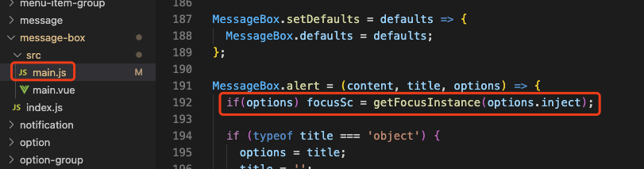

### 小结

到这里基本组件库的问题已经处理大部分了，但是路还很长。因为实际的工程中还有fc组件库，还有我们的SDK，还有交易代码，这些都可能造成内存泄漏。

### 开始新的探索

**__auf_menu_cb__**

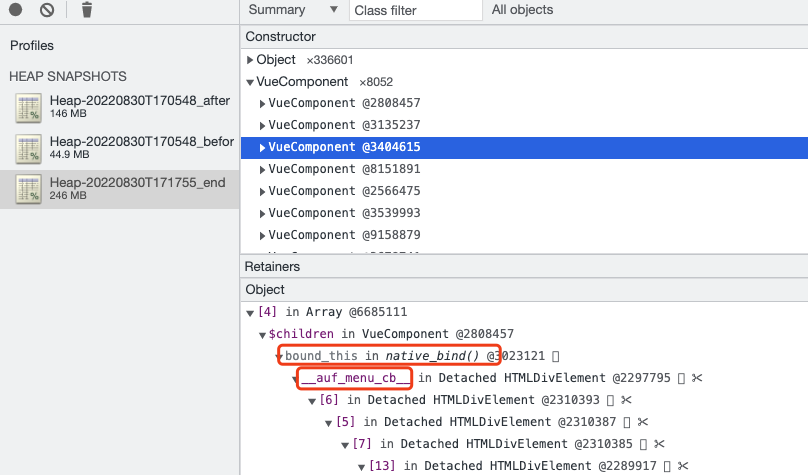

**compareData**

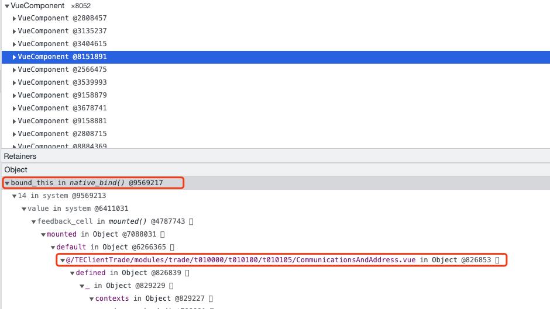

根据上面的经验，查看这个`native_bind`的信息：

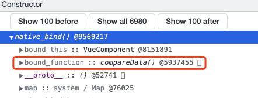

**Trade**

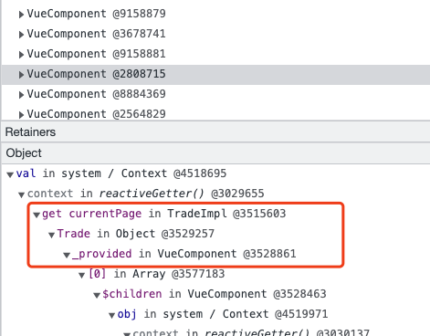

**listeners**

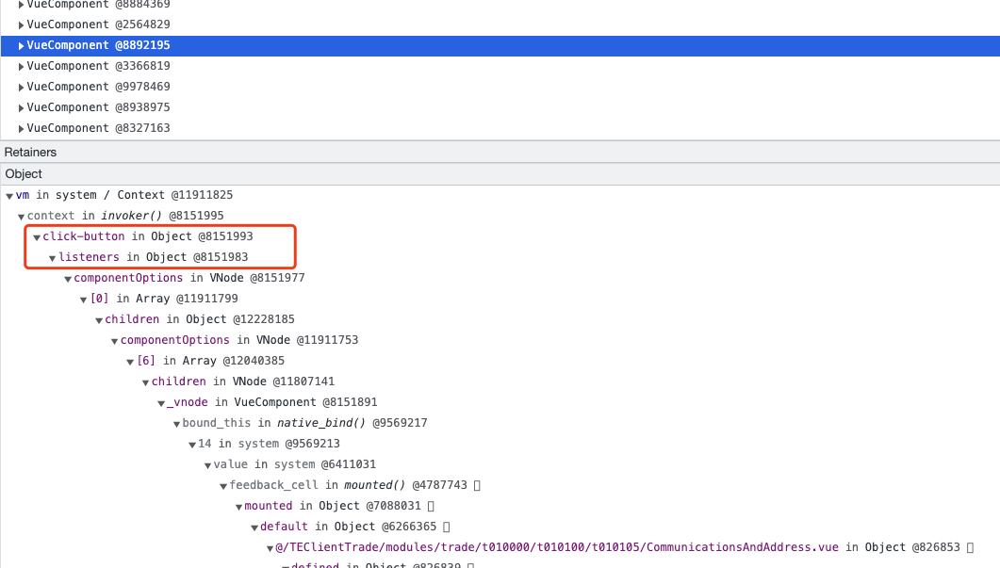

查看这个`listeners`所在的对象：

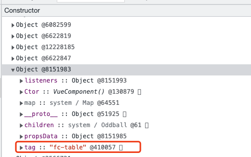

### AND SO ON