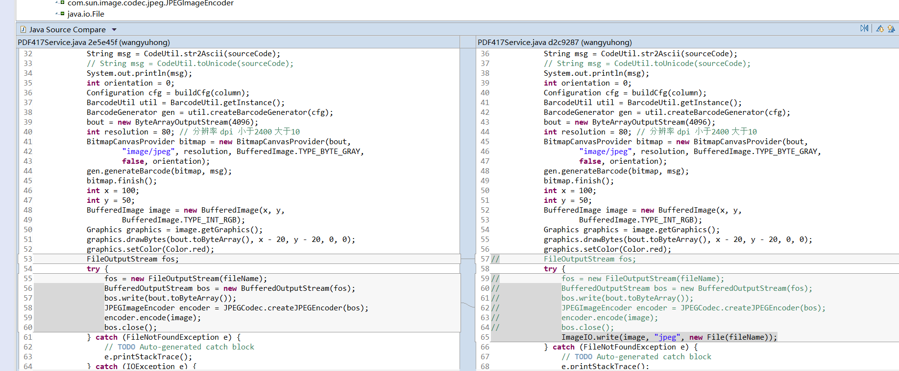

##一、问题描述
北京银行兼容环境，3.x有一个生成条形码的功能调用了rt.jar里的!!#ff0000 com.sun.image.codec.jpeg!!包里的类，发现openjdk不支持
## 二、问题分析
###OpenJdk和jdk的差异
**1.授权协议的不同：**
openjdk采用GPL V2协议放出，而JDK则采用JRL放出。两者协议虽然都是开放源代码的，但是在使用上的不同在于GPL V2允许在商业上使用，而JRL只允许个人研究使用。
**2.OpenJDK不包含Deployment（部署）功能**：
部署的功能包括：Browser Plugin、Java Web Start、以及Java控制面板，这些功能在Openjdk中是找不到的。
**3.OpenJDK源代码不完整：**
在采用GPL协议的Openjdk中，sun jdk的一部分源代码因为产权的问题无法开放openjdk使用，其中最主要的部份就是JMX中的可选元件SNMP部份的代码。因此这些不能开放的源代码 将它作成plug，以供OpenJDK编译时使用，你也可以选择不要使用plug。而Icedtea则为这些不完整的部分开发了相同功能的源代码 (OpenJDK6)，促使OpenJDK更加完整。
**4.部分源代码用开源代码替换：**
由于产权的问题，很多产权不是SUN的源代码被替换成一些功能相同的开源代码，比如说字体栅格化引擎，使用Free Type代替。
**5.openjdk只包含最精简的JDK：**
OpenJDK不包含其他的软件包，比如Rhino Java DB JAXP……，并且可以分离的软件包也都是尽量的分离，但是这大多数都是自由软件，你可以自己下载加入。
**6.不能使用Java商标：**
众所周知，java图标是一杯冒着热气的咖啡，而openJdk由于产权问题，使用了一直小企鹅。
 ###Openjdk相对于Oraclejdk中jre的缺少部分
 经过compare对比jdk1.8.0_152和openlogic-openjdk-8u262-b10-win-32中的jre文件，将openjdk对应的Jre文件中缺少部分整理出来
**1. jfxrt.jar中缺少部分的包名有：**
com.sun.deploy.uitoolkit.impl.fx  
com.sun.javafx.applet 
com.sun.javafx.font.t2k
com.sun.javafx.logging
com.sun.javafx.webkit.drt
**2. 缺少deploy.jar**
deploy.jar是Java部署堆栈的一部分，用于applet和Webstart应用程序，Java安装目录的常见部分 - 该文件运行某些产品的安装。 正确设置Java路径后，用户可以执行此文件（只需双击它或按文件上的Enter键），要部署的应用程序将运行其安装程序。 例如。 诺基亚OVI套件通常使用这种部署形式。
**3. 缺少javaws.jar**
是java提供的一种可以通过浏览器直接执行java应用程序的途径，它使你可以直接通过一个网页上的url连接打开一个java应用程序
**4. 缺少jfr.jar**
JFRJava Flight Recorder(JFR)是一个商业特性，用在生产服务器上是需要商业许可的。JFR 记录了关于 Java 运行时及运行在其内的 Java 应用程序的详细信息，记录用少量的开销完成。数据是作为时间上的数据点(称为事件)记录的。典型的事件可以是线程等待锁、GC、CPU 周期使用数据等。在创建飞行记录时，你可以选择哪些事件应当保存，这叫做记录模板。有些模板只保存基本事件，对性能几乎没有影响。其他模板可能有轻微的性能开销，还可能触发 GC 来收集更多信息。通常，超过百分之几的开销是很罕见。飞行记录可用于调试很大范围的问题，从性能问题到内存泄漏或严重的锁竞争。
**5. plugin.jar中缺少部分的包名有：**
com.sun.deploy.uitoolkit
com.sun.java.browser
netscape.javascript
sun.plugin
sun.plugin2
com.oracle.nio
com.oracle.util
**6. rt.jar中缺少部分的包名有：**
!!#ff0000 com.sun.image.codec.jpeg!!
com.sun.jmx.snmp
com.sun.management.jmx
jdk.internal
jdk.management
sun.management.snmp
sun.print.Win32PrintServiceLookup.class(这个是只缺少这个类)
sun.usagetracker
##三、问题解决
尝试用openjdk中javax.imageio.ImageIO替换!!#ff0000 com.sun.image.codec.jpeg!!去实现图片的生成，经过测试并不能实现，代码如下图：

只能先回退jdk版本
##四、问题延伸
###使用openjdk对客户端的影响
经过jdk1.8的两个版本对比结果来看，缺少的部分已经列出。目前问题都可以直接以错误的形式展现在代码中，包括兼容环境使用openjdk时，针对3.x的代码部分的使用。
在不涉及兼容环境单使用openjdk1.8来说，客户端目前可以正常运行，是因为OpenJDK已经成为JDK7的主干开发，Sun JDK7是在OpenJDK7的基础上发布的，其大部分原始码都相同，只有少部分原始代码被替换掉。客户端壳子所使用的基础代码没有涉及到扩展代码（jdk在openjdk上扩展的部分）。
##五、问题扩展
###openJdk如何打dump**
正常安装的openjdk(以下简称jdk)是完整的，只需要执行命令操作就可以，客户端作为java程序，运行不需使用完整jdk，只需要jre即可。我们一般会在生产客户端根目录下放置一个jre，来满足客户端的运行要求。此时若想使用jdk工具，在abc出现问题时，收集jvm的相关信息，就需要把jdk下面常用的几种工具进行整理，放置到jre对应目录下，并随着abc版本下发，这样就能正常使用jdk自带工具辅助我们分析和定位问题。
jdk中常用的工具如下：
**1. jstack.exe 打印线程的栈信息，制作线程dump文件**
复制方法:
（1）将jdk\bin\jstack.exe复制到jre\bin文件夹中
（2）将jdk\lib\tools.jar 复制到jre\lib文件夹中
常用命令：jstack -l 【PID】 > 【文件名】常用于进程卡住，无响应等问题进行分析和处理。
**2. jmap.exe 打印内存映射，制作堆dump文件**
复制方法：将jdk\bin\jmap.exe复制到jre\bin文件夹中
常用命令：jmap -dump:format=b,file=【文件名】 【PID】常用于分析内存溢出或是内存泄露等问题。
**3. jconsole.exe  JConsole 是一个内置 Java 性能分析器，可以从命令行或在 GUI shell 中运行。您可以轻松地使用 JConsole（或者，它更高端的 “近亲” VisualVM ）来监控 Java 应用程序性能和跟踪 Java 中的代码。**
复制方法：（1）将jdk\bin\jconsole.exe复制到jre\bin文件夹中
         （2）将jdk\lib\jconsole.jar 复制到jre\lib文件夹中。
