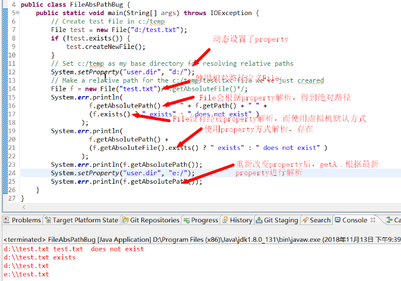
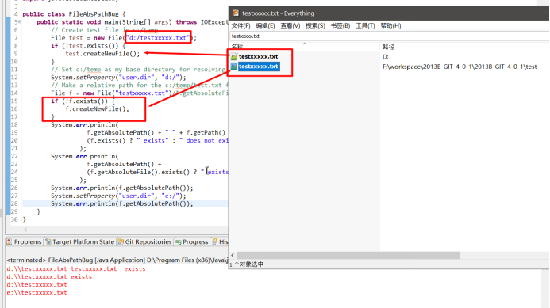
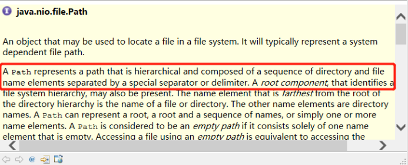
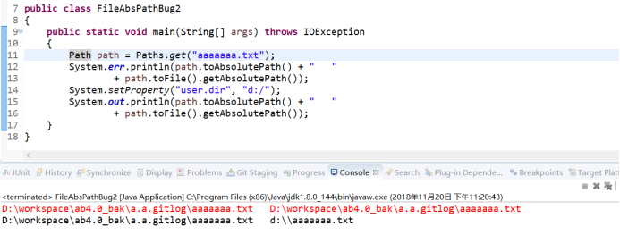

### 1. 问题描述

在使用内嵌 ocx 控件等集成第三方程序时，程序内部可能会有设置用户目录的操作，导致文件后续 file.exists()获取失败，就该问题进行查看并分析。

### 2. 问题分析

先看网上两篇权威网站的文章
https://stackoverflow.com/questions/919918/file-exists-returns-false-when-file-exists
https://bugs.java.com/bugdatabase/view_bug.do;:YfiG?bug_id=4483097

使用相对路径时，如果 user.dir 发生变化会导致下面两个结果运行不一致
file.exists() == false
file.getAbsoluteFile().exists() == true

来自上面第二个链接中 oracle 官网的解释为：
EVALUATION
Not a bug. If you need to resolve a filename against the value of
the "user.dir" system property then you must use getAbsolutePath (or
getAbsoluteFile, or getCanonicalPath, or getCanonicalFile). Simpler
operations such as exists() always resolve against the directory in
which the Java virtual machine was originally invoked (and no, there
is no way to change that).

心里默读三遍，发现没有理解- -！。就此问题在群里进行讨论，结论为：
定义一个 File 时，若使用相对路径，调用 file 的 getAbsxxx 方法时，会由于 user.dir 的改变，影响实际的位置返回。

测试代码为

对代码中调用的方法进行分析

具体讨论过程也可翻看支持群中 20181113 的聊天记录。

### 3. 问题解决

找到原因后，在操作文件时，一定要使用绝对路径定义，防止文件指向存在歧义。例子如下
File file = new File(new File(".").getAbsolutePath(),"test.txt")；
File file = new File("test.txt").getAbsoluteFile()；

那么，还有一个问题，相对路径 file.exists()指向的文件具体在哪呢。为此，把文件改成一个特殊的文件名，判断文件不存在时，进行新建，通过全盘搜索工具 everything，查找文件所在位置，可以看到文件在当前工程目录之下。

回想一下，平常写代码时，特别是 runnable jar，不都是使用相对路径，然后把文件放到 jar 同级目录么，此时程序内部若出现
System.setProperty("user.dir", "e:/");
f.getAbsolutePath();
相关代码，那么恭喜你，成功入坑。

### 4. 问题延伸

JDK7 开始提供了 Path 类，描述如下图：

简而言之就是，Path 用于来表示文件路径和文件，那用 Path 修改环境变量后有没有同样的问题呢，上测试代码：

测试发现，修改环境变量后，用 path 获取路径解析是没有问题的，但将 path 转 File 后还是会有同样的问题，这是不是从侧面说明 path 的强大，所以推荐大家文件操作时使用 Path、Files 和 Paths 等相关类。

### 5. 思考延伸

若用 File file = new File("test.txt")方式定义文件，user.dir 发生改变时，file.exists()；file.getAbsoluteFile().exists()分别返回什么结果。
